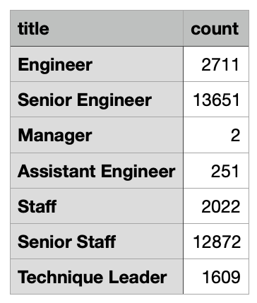
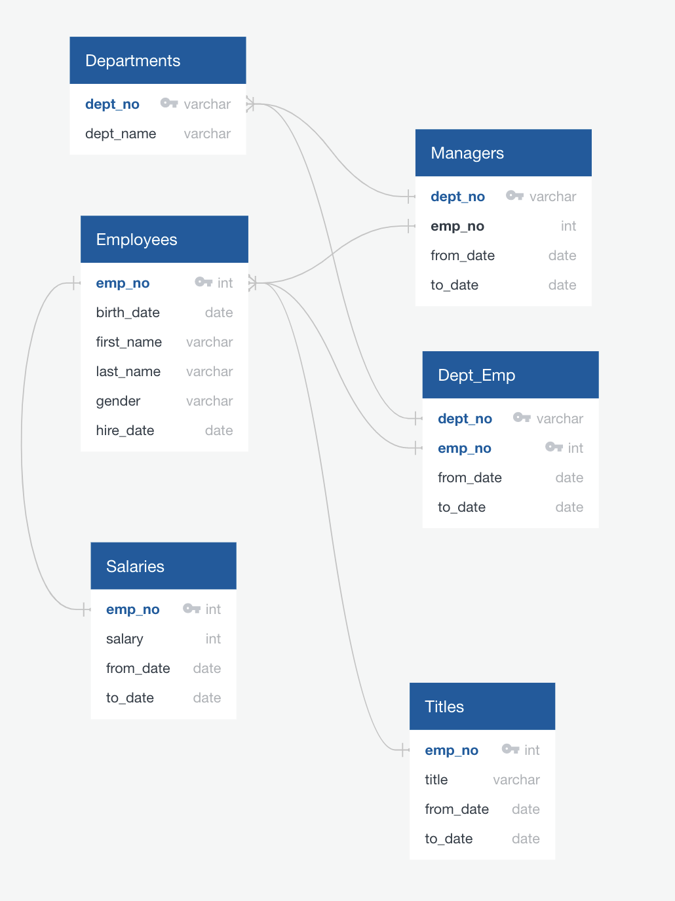

# Pewlett-Hackard-Analysis

## Summary of the results:

### Technical Analysis Deliverable 1: Number of Retiring Employees by Title. 
This analysis shows the total number of people retiring, number of employees with each title retiring and a list of current employees born between Jan. 1, 1952 and Dec. 31, 1955 in other words retiring employees.

- total number of individuals retiring is 33,118
- number of individuals retiring in each department:

Pewlett_Hackard has 300,024 employees out of that number 33,118 employees are retiring, it is 11% of employees. Looking at the numbers per each department, most of the peple retiring (80%) are in senior positions (Senior Engineer 13,651, Senior Staff 12,872). 

### Technical Analysis Deliverable 2: Mentorship Eligibility.

To be eligible to participate in the mentorship program, employees will need to have a date of birth that falls between January 1, 1965 and December 31, 1965.

- number of individuals available for mentorship role is 1,549

## Recomentations:

For further analysis I would strongly recommend to create another tables with deeper understanding of the current picture in the company. 
For example:
- percentage of the retiring employees in each department
- second wave of retirements
- employees retiring in senior positions per department

